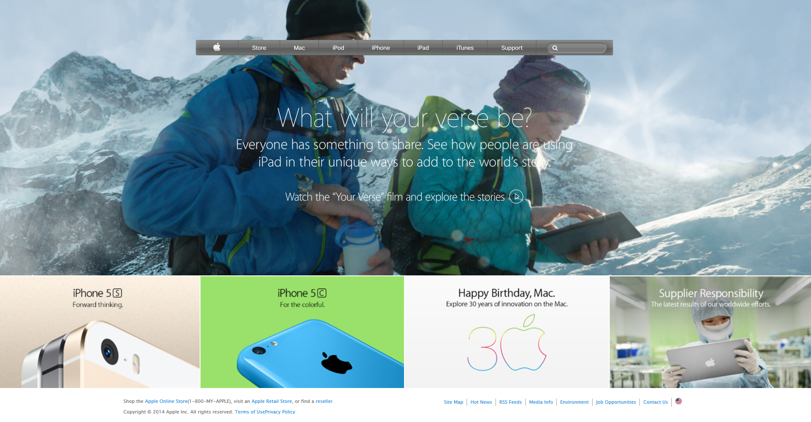

# HTML and CSS NY Time page clone

> This is an NY timepage clone made for an assignment of HTML/CSS.

We created this project using some images and buttons tags, also we used flex boxes, floats and gird systems for positioning.

## Built With

- HTML.
- CSS.
- VS Code.
- Git/GitHub.

## Live Demo

[Live Demo Link](https://kenderb.github.io/NYTime-page-clone/)

## How to run it

To get a local copy up and running follow these simple steps.

* If you're using latest version of git.

* Clone this url https://github.com/kenderb/New-York-Times-article-page.git on your local host.

* You have to use a Web explorer browser like Google Chrome or Mozilla Firefox to open the index.html file.

## Authors

👤 **carloso0114**

- GitHub: [@carloso0114](https://github.com/AlejandroNo4)
- Twitter: [@Carlos_Osp1](https://twitter.com/Carlos_Osp1)
- LinkedIn: [Carlos Ospina](https://www.linkedin.com/in/carlos-ospina-242b831a6/)

👤 **KenderB**

- GitHub: [@kenderb](https://github.com/githubhandle)
- Twitter: [@KBTarts](https://twitter.com/KBTarts)
- LinkedIn: [Kender Bolivar](https://www.linkedin.com/in/kender-bolivar-1736086b//)

## Show your support

Give a ⭐️ if you like this project!

## Acknowledgments

- NY timepage clone.

## 📝 License

This project is [MIT](https://github.com/kenderb/New-York-Times-article-page/blob/Clone-page/LICENSE) licensed.

